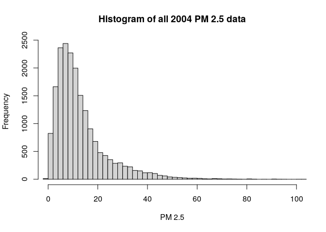
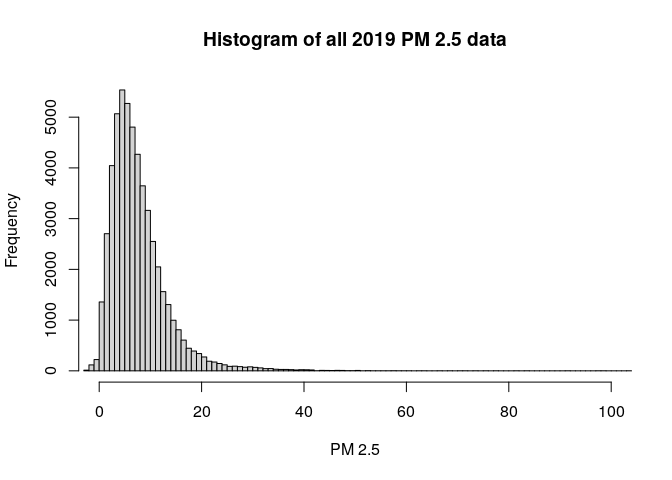
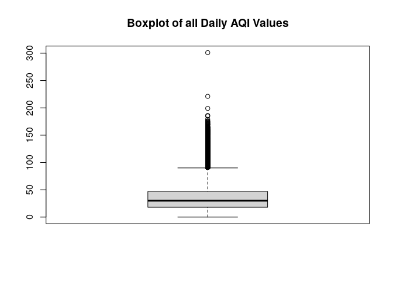
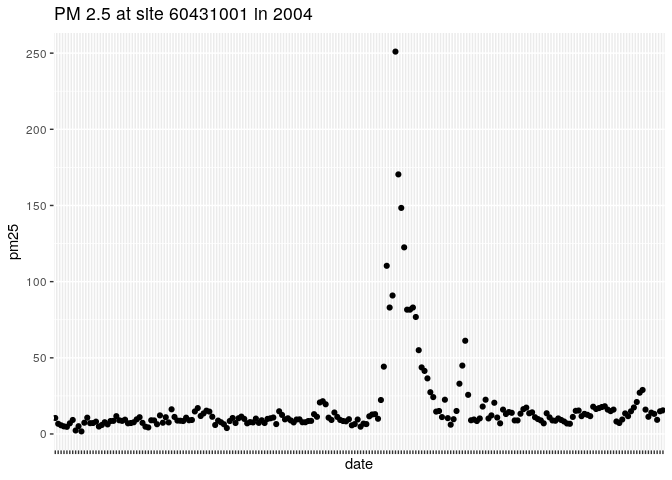
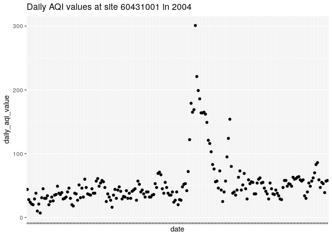
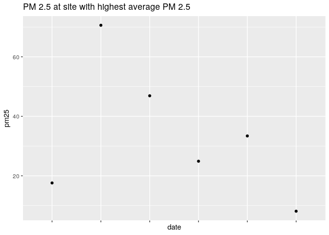
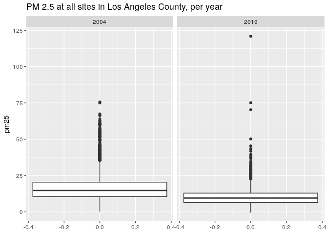
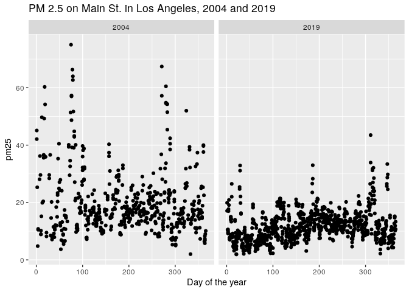
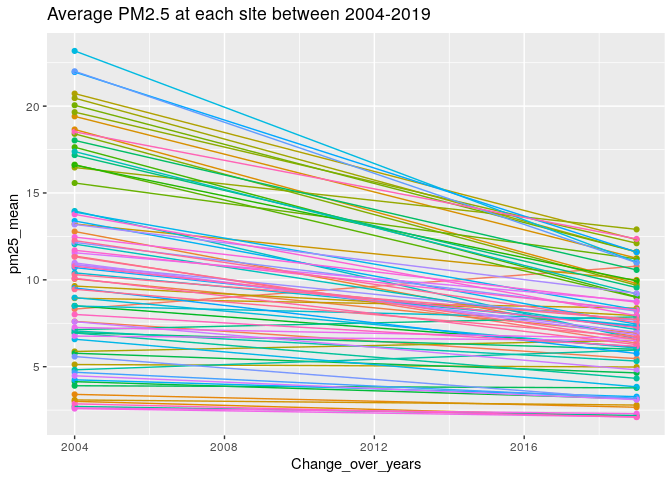

PM 566 Assignment 1
================
Chris Hanson
September 24, 2021

### In this assignment I am given the task of determining whether daily concentration of PM2.5 has decreased in California in the last 15 years. To do this I am using data provided by the U.S. EPA.

<br>

### **Problem 1.** *Read in the data. Check dimensions, headers, footers, variable names, and variable types. Check for any data issues, particularly in the key variables. Summarize all findings.*

I read in the data using data.table():

``` r
pm2004 <- data.table::fread("ad_viz_plotval_data_2004.csv")
pm2004 <- clean_names(pm2004)
pm2019 <- data.table::fread("ad_viz_plotval_data_2019.csv")
pm2019 <- clean_names(pm2019)
```

I then check dimensions, headers, footers, variable names, variable
types, and summary statistics. I check for missing values, and I plot
histograms to visually inspect the data.

``` r
# Check dimensions
paste("The 2004 dataset has", dim(pm2004)[1], "observations and", dim(pm2004)[2], "variables.")
```

    ## [1] "The 2004 dataset has 19233 observations and 20 variables."

``` r
paste("The 2019 dataset has", dim(pm2019)[1], "observations and", dim(pm2019)[2], "variables.")
```

    ## [1] "The 2019 dataset has 53086 observations and 20 variables."

``` r
# Check headers
head(pm2004, n=3)
```

    ##          date source  site_id poc daily_mean_pm2_5_concentration    units
    ## 1: 01/01/2004    AQS 60010007   1                           11.0 ug/m3 LC
    ## 2: 01/02/2004    AQS 60010007   1                           12.2 ug/m3 LC
    ## 3: 01/03/2004    AQS 60010007   1                           16.5 ug/m3 LC
    ##    daily_aqi_value site_name daily_obs_count percent_complete
    ## 1:              46 Livermore               1              100
    ## 2:              51 Livermore               1              100
    ## 3:              60 Livermore               1              100
    ##    aqs_parameter_code                     aqs_parameter_desc cbsa_code
    ## 1:              88502 Acceptable PM2.5 AQI & Speciation Mass     41860
    ## 2:              88502 Acceptable PM2.5 AQI & Speciation Mass     41860
    ## 3:              88502 Acceptable PM2.5 AQI & Speciation Mass     41860
    ##                            cbsa_name state_code      state county_code  county
    ## 1: San Francisco-Oakland-Hayward, CA          6 California           1 Alameda
    ## 2: San Francisco-Oakland-Hayward, CA          6 California           1 Alameda
    ## 3: San Francisco-Oakland-Hayward, CA          6 California           1 Alameda
    ##    site_latitude site_longitude
    ## 1:      37.68753      -121.7842
    ## 2:      37.68753      -121.7842
    ## 3:      37.68753      -121.7842

``` r
head(pm2019, n=3)
```

    ##          date source  site_id poc daily_mean_pm2_5_concentration    units
    ## 1: 01/01/2019    AQS 60010007   3                            5.7 ug/m3 LC
    ## 2: 01/02/2019    AQS 60010007   3                           11.9 ug/m3 LC
    ## 3: 01/03/2019    AQS 60010007   3                           20.1 ug/m3 LC
    ##    daily_aqi_value site_name daily_obs_count percent_complete
    ## 1:              24 Livermore               1              100
    ## 2:              50 Livermore               1              100
    ## 3:              68 Livermore               1              100
    ##    aqs_parameter_code       aqs_parameter_desc cbsa_code
    ## 1:              88101 PM2.5 - Local Conditions     41860
    ## 2:              88101 PM2.5 - Local Conditions     41860
    ## 3:              88101 PM2.5 - Local Conditions     41860
    ##                            cbsa_name state_code      state county_code  county
    ## 1: San Francisco-Oakland-Hayward, CA          6 California           1 Alameda
    ## 2: San Francisco-Oakland-Hayward, CA          6 California           1 Alameda
    ## 3: San Francisco-Oakland-Hayward, CA          6 California           1 Alameda
    ##    site_latitude site_longitude
    ## 1:      37.68753      -121.7842
    ## 2:      37.68753      -121.7842
    ## 3:      37.68753      -121.7842

``` r
# Check footers
tail(pm2004, n=3)
```

    ##          date source  site_id poc daily_mean_pm2_5_concentration    units
    ## 1: 12/23/2004    AQS 61131003   1                              9 ug/m3 LC
    ## 2: 12/26/2004    AQS 61131003   1                             24 ug/m3 LC
    ## 3: 12/29/2004    AQS 61131003   1                              9 ug/m3 LC
    ##    daily_aqi_value            site_name daily_obs_count percent_complete
    ## 1:              38 Woodland-Gibson Road               1              100
    ## 2:              76 Woodland-Gibson Road               1              100
    ## 3:              38 Woodland-Gibson Road               1              100
    ##    aqs_parameter_code       aqs_parameter_desc cbsa_code
    ## 1:              88101 PM2.5 - Local Conditions     40900
    ## 2:              88101 PM2.5 - Local Conditions     40900
    ## 3:              88101 PM2.5 - Local Conditions     40900
    ##                                  cbsa_name state_code      state county_code
    ## 1: Sacramento--Roseville--Arden-Arcade, CA          6 California         113
    ## 2: Sacramento--Roseville--Arden-Arcade, CA          6 California         113
    ## 3: Sacramento--Roseville--Arden-Arcade, CA          6 California         113
    ##    county site_latitude site_longitude
    ## 1:   Yolo      38.66121      -121.7327
    ## 2:   Yolo      38.66121      -121.7327
    ## 3:   Yolo      38.66121      -121.7327

``` r
tail(pm2019, n=3)
```

    ##          date source  site_id poc daily_mean_pm2_5_concentration    units
    ## 1: 12/17/2019    AQS 61131003   1                           23.8 ug/m3 LC
    ## 2: 12/23/2019    AQS 61131003   1                            1.0 ug/m3 LC
    ## 3: 12/29/2019    AQS 61131003   1                            9.1 ug/m3 LC
    ##    daily_aqi_value            site_name daily_obs_count percent_complete
    ## 1:              76 Woodland-Gibson Road               1              100
    ## 2:               4 Woodland-Gibson Road               1              100
    ## 3:              38 Woodland-Gibson Road               1              100
    ##    aqs_parameter_code       aqs_parameter_desc cbsa_code
    ## 1:              88101 PM2.5 - Local Conditions     40900
    ## 2:              88101 PM2.5 - Local Conditions     40900
    ## 3:              88101 PM2.5 - Local Conditions     40900
    ##                                  cbsa_name state_code      state county_code
    ## 1: Sacramento--Roseville--Arden-Arcade, CA          6 California         113
    ## 2: Sacramento--Roseville--Arden-Arcade, CA          6 California         113
    ## 3: Sacramento--Roseville--Arden-Arcade, CA          6 California         113
    ##    county site_latitude site_longitude
    ## 1:   Yolo      38.66121      -121.7327
    ## 2:   Yolo      38.66121      -121.7327
    ## 3:   Yolo      38.66121      -121.7327

``` r
# Check variable names
paste(colnames(pm2004))
```

    ##  [1] "date"                           "source"                        
    ##  [3] "site_id"                        "poc"                           
    ##  [5] "daily_mean_pm2_5_concentration" "units"                         
    ##  [7] "daily_aqi_value"                "site_name"                     
    ##  [9] "daily_obs_count"                "percent_complete"              
    ## [11] "aqs_parameter_code"             "aqs_parameter_desc"            
    ## [13] "cbsa_code"                      "cbsa_name"                     
    ## [15] "state_code"                     "state"                         
    ## [17] "county_code"                    "county"                        
    ## [19] "site_latitude"                  "site_longitude"

``` r
# Check variable types
sapply(pm2004, typeof)
```

    ##                           date                         source 
    ##                    "character"                    "character" 
    ##                        site_id                            poc 
    ##                      "integer"                      "integer" 
    ## daily_mean_pm2_5_concentration                          units 
    ##                       "double"                    "character" 
    ##                daily_aqi_value                      site_name 
    ##                      "integer"                    "character" 
    ##                daily_obs_count               percent_complete 
    ##                      "integer"                       "double" 
    ##             aqs_parameter_code             aqs_parameter_desc 
    ##                      "integer"                    "character" 
    ##                      cbsa_code                      cbsa_name 
    ##                      "integer"                    "character" 
    ##                     state_code                          state 
    ##                      "integer"                    "character" 
    ##                    county_code                         county 
    ##                      "integer"                    "character" 
    ##                  site_latitude                 site_longitude 
    ##                       "double"                       "double"

``` r
# Check for issues in key variables:
str(pm2004) # General readout
```

    ## Classes 'data.table' and 'data.frame':   19233 obs. of  20 variables:
    ##  $ date                          : chr  "01/01/2004" "01/02/2004" "01/03/2004" "01/04/2004" ...
    ##  $ source                        : chr  "AQS" "AQS" "AQS" "AQS" ...
    ##  $ site_id                       : int  60010007 60010007 60010007 60010007 60010007 60010007 60010007 60010007 60010007 60010007 ...
    ##  $ poc                           : int  1 1 1 1 1 1 1 1 1 1 ...
    ##  $ daily_mean_pm2_5_concentration: num  11 12.2 16.5 19.5 11.5 32.5 15.5 29.9 21 16.9 ...
    ##  $ units                         : chr  "ug/m3 LC" "ug/m3 LC" "ug/m3 LC" "ug/m3 LC" ...
    ##  $ daily_aqi_value               : int  46 51 60 67 48 94 58 88 70 61 ...
    ##  $ site_name                     : chr  "Livermore" "Livermore" "Livermore" "Livermore" ...
    ##  $ daily_obs_count               : int  1 1 1 1 1 1 1 1 1 1 ...
    ##  $ percent_complete              : num  100 100 100 100 100 100 100 100 100 100 ...
    ##  $ aqs_parameter_code            : int  88502 88502 88502 88502 88502 88502 88502 88502 88502 88502 ...
    ##  $ aqs_parameter_desc            : chr  "Acceptable PM2.5 AQI & Speciation Mass" "Acceptable PM2.5 AQI & Speciation Mass" "Acceptable PM2.5 AQI & Speciation Mass" "Acceptable PM2.5 AQI & Speciation Mass" ...
    ##  $ cbsa_code                     : int  41860 41860 41860 41860 41860 41860 41860 41860 41860 41860 ...
    ##  $ cbsa_name                     : chr  "San Francisco-Oakland-Hayward, CA" "San Francisco-Oakland-Hayward, CA" "San Francisco-Oakland-Hayward, CA" "San Francisco-Oakland-Hayward, CA" ...
    ##  $ state_code                    : int  6 6 6 6 6 6 6 6 6 6 ...
    ##  $ state                         : chr  "California" "California" "California" "California" ...
    ##  $ county_code                   : int  1 1 1 1 1 1 1 1 1 1 ...
    ##  $ county                        : chr  "Alameda" "Alameda" "Alameda" "Alameda" ...
    ##  $ site_latitude                 : num  37.7 37.7 37.7 37.7 37.7 ...
    ##  $ site_longitude                : num  -122 -122 -122 -122 -122 ...
    ##  - attr(*, ".internal.selfref")=<externalptr>

``` r
summary(pm2004) #Summary statistics
```

    ##      date              source             site_id              poc        
    ##  Length:19233       Length:19233       Min.   :60010007   Min.   : 1.000  
    ##  Class :character   Class :character   1st Qu.:60370002   1st Qu.: 1.000  
    ##  Mode  :character   Mode  :character   Median :60658001   Median : 1.000  
    ##                                        Mean   :60588026   Mean   : 1.816  
    ##                                        3rd Qu.:60750006   3rd Qu.: 2.000  
    ##                                        Max.   :61131003   Max.   :12.000  
    ##                                                                           
    ##  daily_mean_pm2_5_concentration    units           daily_aqi_value 
    ##  Min.   : -0.10                 Length:19233       Min.   :  0.00  
    ##  1st Qu.:  6.00                 Class :character   1st Qu.: 25.00  
    ##  Median : 10.10                 Mode  :character   Median : 42.00  
    ##  Mean   : 13.13                                    Mean   : 46.33  
    ##  3rd Qu.: 16.30                                    3rd Qu.: 60.00  
    ##  Max.   :251.00                                    Max.   :301.00  
    ##                                                                    
    ##   site_name         daily_obs_count percent_complete aqs_parameter_code
    ##  Length:19233       Min.   :1       Min.   :100      Min.   :88101     
    ##  Class :character   1st Qu.:1       1st Qu.:100      1st Qu.:88101     
    ##  Mode  :character   Median :1       Median :100      Median :88101     
    ##                     Mean   :1       Mean   :100      Mean   :88267     
    ##                     3rd Qu.:1       3rd Qu.:100      3rd Qu.:88502     
    ##                     Max.   :1       Max.   :100      Max.   :88502     
    ##                                                                        
    ##  aqs_parameter_desc   cbsa_code      cbsa_name           state_code
    ##  Length:19233       Min.   :12540   Length:19233       Min.   :6   
    ##  Class :character   1st Qu.:31080   Class :character   1st Qu.:6   
    ##  Mode  :character   Median :40140   Mode  :character   Median :6   
    ##                     Mean   :35328                      Mean   :6   
    ##                     3rd Qu.:41860                      3rd Qu.:6   
    ##                     Max.   :49700                      Max.   :6   
    ##                     NA's   :1253                                   
    ##     state            county_code        county          site_latitude  
    ##  Length:19233       Min.   :  1.00   Length:19233       Min.   :32.63  
    ##  Class :character   1st Qu.: 37.00   Class :character   1st Qu.:34.07  
    ##  Mode  :character   Median : 65.00   Mode  :character   Median :36.48  
    ##                     Mean   : 58.63                      Mean   :36.23  
    ##                     3rd Qu.: 75.00                      3rd Qu.:38.10  
    ##                     Max.   :113.00                      Max.   :41.71  
    ##                                                                        
    ##  site_longitude  
    ##  Min.   :-124.2  
    ##  1st Qu.:-121.6  
    ##  Median :-119.3  
    ##  Mean   :-119.7  
    ##  3rd Qu.:-117.9  
    ##  Max.   :-115.5  
    ## 

``` r
summary(pm2004$daily_mean_pm2_5_concentration) #Key variable
```

    ##    Min. 1st Qu.  Median    Mean 3rd Qu.    Max. 
    ##   -0.10    6.00   10.10   13.13   16.30  251.00

``` r
mean(is.na(pm2004$daily_mean_pm2_5_concentration)) #No missing values
```

    ## [1] 0

``` r
hist(pm2004$daily_mean_pm2_5_concentration, breaks = 100, main = "Histogram of all 2004 PM 2.5 data", xlab = "PM 2.5", xlim=c(0,100)) #2004 histogram
```

<!-- -->

``` r
str(pm2019) # General readout
```

    ## Classes 'data.table' and 'data.frame':   53086 obs. of  20 variables:
    ##  $ date                          : chr  "01/01/2019" "01/02/2019" "01/03/2019" "01/04/2019" ...
    ##  $ source                        : chr  "AQS" "AQS" "AQS" "AQS" ...
    ##  $ site_id                       : int  60010007 60010007 60010007 60010007 60010007 60010007 60010007 60010007 60010007 60010007 ...
    ##  $ poc                           : int  3 3 3 3 3 3 3 3 3 3 ...
    ##  $ daily_mean_pm2_5_concentration: num  5.7 11.9 20.1 28.8 11.2 2.7 2.8 7 3.1 7.1 ...
    ##  $ units                         : chr  "ug/m3 LC" "ug/m3 LC" "ug/m3 LC" "ug/m3 LC" ...
    ##  $ daily_aqi_value               : int  24 50 68 86 47 11 12 29 13 30 ...
    ##  $ site_name                     : chr  "Livermore" "Livermore" "Livermore" "Livermore" ...
    ##  $ daily_obs_count               : int  1 1 1 1 1 1 1 1 1 1 ...
    ##  $ percent_complete              : num  100 100 100 100 100 100 100 100 100 100 ...
    ##  $ aqs_parameter_code            : int  88101 88101 88101 88101 88101 88101 88101 88101 88101 88101 ...
    ##  $ aqs_parameter_desc            : chr  "PM2.5 - Local Conditions" "PM2.5 - Local Conditions" "PM2.5 - Local Conditions" "PM2.5 - Local Conditions" ...
    ##  $ cbsa_code                     : int  41860 41860 41860 41860 41860 41860 41860 41860 41860 41860 ...
    ##  $ cbsa_name                     : chr  "San Francisco-Oakland-Hayward, CA" "San Francisco-Oakland-Hayward, CA" "San Francisco-Oakland-Hayward, CA" "San Francisco-Oakland-Hayward, CA" ...
    ##  $ state_code                    : int  6 6 6 6 6 6 6 6 6 6 ...
    ##  $ state                         : chr  "California" "California" "California" "California" ...
    ##  $ county_code                   : int  1 1 1 1 1 1 1 1 1 1 ...
    ##  $ county                        : chr  "Alameda" "Alameda" "Alameda" "Alameda" ...
    ##  $ site_latitude                 : num  37.7 37.7 37.7 37.7 37.7 ...
    ##  $ site_longitude                : num  -122 -122 -122 -122 -122 ...
    ##  - attr(*, ".internal.selfref")=<externalptr>

``` r
summary(pm2019) #Summary statistics
```

    ##      date              source             site_id              poc        
    ##  Length:53086       Length:53086       Min.   :60010007   Min.   : 1.000  
    ##  Class :character   Class :character   1st Qu.:60310004   1st Qu.: 1.000  
    ##  Mode  :character   Mode  :character   Median :60612003   Median : 3.000  
    ##                                        Mean   :60565291   Mean   : 2.562  
    ##                                        3rd Qu.:60771002   3rd Qu.: 3.000  
    ##                                        Max.   :61131003   Max.   :21.000  
    ##                                                                           
    ##  daily_mean_pm2_5_concentration    units           daily_aqi_value 
    ##  Min.   : -2.200                Length:53086       Min.   :  0.00  
    ##  1st Qu.:  4.000                Class :character   1st Qu.: 17.00  
    ##  Median :  6.500                Mode  :character   Median : 27.00  
    ##  Mean   :  7.734                                   Mean   : 30.56  
    ##  3rd Qu.:  9.900                                   3rd Qu.: 41.00  
    ##  Max.   :120.900                                   Max.   :185.00  
    ##                                                                    
    ##   site_name         daily_obs_count percent_complete aqs_parameter_code
    ##  Length:53086       Min.   :1       Min.   :100      Min.   :88101     
    ##  Class :character   1st Qu.:1       1st Qu.:100      1st Qu.:88101     
    ##  Mode  :character   Median :1       Median :100      Median :88101     
    ##                     Mean   :1       Mean   :100      Mean   :88214     
    ##                     3rd Qu.:1       3rd Qu.:100      3rd Qu.:88502     
    ##                     Max.   :1       Max.   :100      Max.   :88502     
    ##                                                                        
    ##  aqs_parameter_desc   cbsa_code      cbsa_name           state_code
    ##  Length:53086       Min.   :12540   Length:53086       Min.   :6   
    ##  Class :character   1st Qu.:31080   Class :character   1st Qu.:6   
    ##  Mode  :character   Median :40140   Mode  :character   Median :6   
    ##                     Mean   :35841                      Mean   :6   
    ##                     3rd Qu.:41860                      3rd Qu.:6   
    ##                     Max.   :49700                      Max.   :6   
    ##                     NA's   :4181                                   
    ##     state            county_code        county          site_latitude  
    ##  Length:53086       Min.   :  1.00   Length:53086       Min.   :32.58  
    ##  Class :character   1st Qu.: 31.00   Class :character   1st Qu.:34.14  
    ##  Mode  :character   Median : 61.00   Mode  :character   Median :36.63  
    ##                     Mean   : 56.39                      Mean   :36.35  
    ##                     3rd Qu.: 77.00                      3rd Qu.:37.97  
    ##                     Max.   :113.00                      Max.   :41.76  
    ##                                                                        
    ##  site_longitude  
    ##  Min.   :-124.2  
    ##  1st Qu.:-121.6  
    ##  Median :-119.8  
    ##  Mean   :-119.8  
    ##  3rd Qu.:-118.1  
    ##  Max.   :-115.5  
    ## 

``` r
summary(pm2019$daily_mean_pm2_5_concentration) #Key variable
```

    ##    Min. 1st Qu.  Median    Mean 3rd Qu.    Max. 
    ##  -2.200   4.000   6.500   7.734   9.900 120.900

``` r
mean(is.na(pm2019$daily_mean_pm2_5_concentration)) #No missing values
```

    ## [1] 0

``` r
hist(pm2019$daily_mean_pm2_5_concentration, breaks = 100, main = "Histogram of all 2019 PM 2.5 data", xlab = "PM 2.5", xlim=c(0,100)) #2019 histogram
```

<!-- -->

Summary of findings: The 2019 data is significantly larger than the 2004
data. The max values of PM2.5 are very high compared to the mean. This
will be investigated later to see whether it’s an error or a natural
occurrence.

<br>

### **Problem 2.** *Combine the two years of data into one data frame. Use the Date variable to create a new column for year, which will serve as an identifier. Change the names of the key variables so that they are easier to refer to in your code.*

``` r
# Combine the two years of data into one data frame.
pm <- rbind(pm2004, pm2019)

# Use the Date variable to create a new column for year, which will serve as an identifier.
dates <- pm$date
dates2 <- as.POSIXct(dates, format = "%m/%d/%Y")
dates3 <- format(dates2, format="%Y") 

pm <-  mutate(pm, year = dates3) #New column "year" added

# Change the names of the key variables so that they are easier to refer to in your code.
pm <- rename(pm, pm25 = daily_mean_pm2_5_concentration)

pm$year <- as.numeric(pm$year) #so that colorNumeric works
```

<br>

### **Problem 3.** *Create a basic map in leaflet() that shows the locations of the sites (make sure to use different colors for each year). Summarize the spatial distribution of the monitoring sites.*

``` r
# Creating a basic map in leaflet() that shows the locations of the sites.
pal <- colorNumeric(palette = "RdYlBu", domain=c(2004, 2019)) 

map <- leaflet(pm) %>%
  addProviderTiles('OpenStreetMap') %>% 
  addCircles(lat=~site_latitude,lng=~site_longitude, color=pal(pm$year), opacity=1, fillOpacity=1, radius=100)
  #addLegend('bottomleft', pal=pal, values=~c(2004, 2019),
          #title='Site Locations', opacity=1)

map
```

As seen in this map, both years have well distributed sites, but 2019
(blue) has considerably more sites. The sites tend to be concentrated
along the coast, and by the large cities. This makes sense, as high
PM2.5 values are associated with combustion of gasoline, so these areas
require greater scrutiny. (I couldn’t get the leaflet “addLegend”
functionality to work) <br>

### **Problem 4.** *Check for any missing or implausible values of PM2.5 in the combined data set. Explore the proportions of each and provide a summary of any temporal patterns you see in these observations.*

I check for NA values in the entire data set, and find which variable
they belong to:

``` r
mean(is.na(pm))
```

    ## [1] 0.003578063

``` r
mean(is.na(pm$cbsa_code))
```

    ## [1] 0.07513931

``` r
mean(is.na(pm$cbsa_code))/mean(is.na(pm))
```

    ## [1] 21

0.36% of all data is missing, and 7.5% of the “cbsa\_code” data is
missing. As 7.5 is 21x greater than 0.36, and there are 21 variables,
that means all missing data is from the “cbsa\_code” column.

Now I investigate extreme values in the data set to determine whether
they’re errors or natural outliers. I start with Daily AQI values:

``` r
# Extreme values
boxplot(pm$daily_aqi_value, main = "Boxplot of all Daily AQI Values")
```

<!-- -->

``` r
summary(pm$daily_aqi_value) 
```

    ##    Min. 1st Qu.  Median    Mean 3rd Qu.    Max. 
    ##    0.00   18.00   30.00   34.75   47.00  301.00

Here we see an extreme outlier of AQI = 301. According to airnow.gov, an
AQI (air quality index) of 301 or higher represents an emergency
condition. This value is most associated with wildfires, which is not
unreasonable. I now consider PM2.5 values:

``` r
boxplot(pm$pm25, main = "Boxplot of all PM 2.5 Values")
```

<!-- -->

``` r
summary(pm$pm25) 
```

    ##    Min. 1st Qu.  Median    Mean 3rd Qu.    Max. 
    ##  -2.200   4.400   7.200   9.168  11.300 251.000

PM 2.5 has an extremely high Max value of 251, perhaps this is
associated with the same event observed in the high AQI event discovered
above?

``` r
pm[which(grepl(251, pm$pm25)), daily_aqi_value]
```

    ## [1] 301

The extreme PM2.5 and AQI values did indeed come from the same reading,
suggesting they are both accurate readings of an extreme weather event.
Investigating further:

``` r
# at which site is this supposed wildfire happening?
wildfire_site_index = which(grepl(251, pm$pm25))
wildfire_site_id = pm[wildfire_site_index,site_id]
#what year?
wildfire_year = pm[wildfire_site_index,year]
```

Plotting PM2.5 at the site in question to see if it’s insightful:

``` r
pmfire <- filter(pm, site_id == wildfire_site_id, year == wildfire_year)
ggplot(data = pmfire, aes(x=date, y=pm25)) +
  geom_point() + ggtitle("PM 2.5 at site 60431001 in 2004") + theme(axis.text.x = element_blank())
```

<!-- -->

That graph pretty clearly tells the story of a natural extreme event,
likely a wildfire. Just to confirm, I plot the Daily AQI values:

``` r
ggplot(data = pmfire, aes(x=date, y=daily_aqi_value)) +
  geom_point() + ggtitle("Daily AQI values at site 60431001 in 2004") + theme(axis.text.x = element_blank())
```

<!-- -->

The plot of Daily AQI values at this site confirms the story.

Moving on, I check if the sites with the highest average PM2.5 values
seem plausible:

``` r
# calc ave PM2.5 by site
pm_ave <- pm %>% group_by(site_id) %>% summarize(mean25 = mean(pm25))
# max(pm_ave$mean25) # find the highest average pm2.5 value (unused)
#which index of pm_ave has this max average value?
high_site_index = which(pm_ave$mean25 %in% max(pm_ave$mean25))
#what is the site id associated with this max value?
high_site = pm_ave$site_id[high_site_index]
#let's graph pm25 at this site in 2004
pmhigh_2004 <- filter(pm, site_id == high_site, year == 2004)
ggplot(data = pmhigh_2004, aes(x=date, y=pm25)) +
  geom_point() + ggtitle("PM 2.5 at site with highest average PM 2.5") + theme(axis.text.x = element_blank())
```

<!-- -->

This sparse data wasn’t very revealing, let’s try the second highest
value:

``` r
next_highest = max( pm_ave$mean25[pm_ave$mean25!=max(pm_ave$mean25)])
nexthighest_index = which(pm_ave$mean25 %in% next_highest)
nexthighest_site = pm_ave$site_id[nexthighest_index]
pmnexthigh_2004 <- filter(pm, site_id == nexthighest_site, year == 2004)
ggplot(data = pmnexthigh_2004, aes(x=date, y=pm25)) +
  geom_point() + ggtitle("PM 2.5 at site with second highest average PM 2.5") + theme(axis.text.x = element_blank())
```

<!-- -->

This was done to reveal whether the outliers in the data set followed a
discernible pattern or were random. I found these high average PM2.5
sites to have credible data - but they don’t suggest a wildfire like the
previous investigation did.

<br>

### **Problem 5.** *Explore the main question of interest at three different spatial levels. Create exploratory plots (e.g. boxplots, histograms, line plots) and summary statistics that best suit each level of data. Be sure to write up explanations of what you observe in these data.*

Much of the code below was inspired by Chapter 16 of Exploratory Data
Analysis by Roger Peng.

<br>

State-wide analysis:

``` r
#Boxplots of 2004 and 2019 PM25 for the entire state
ggplot(data = pm, aes(y=pm25)) +
  geom_boxplot()+
  facet_wrap(~year)+
  coord_cartesian(ylim = c(0,150)) + 
  ggtitle("PM 2.5 at all sites in California, per year")
```

<!-- -->

``` r
#Summary of 2004 and 2019 PM2.5 statistics for the entire state
with(pm, tapply(pm25, year, summary))
```

    ## $`2004`
    ##    Min. 1st Qu.  Median    Mean 3rd Qu.    Max. 
    ##   -0.10    6.00   10.10   13.13   16.30  251.00 
    ## 
    ## $`2019`
    ##    Min. 1st Qu.  Median    Mean 3rd Qu.    Max. 
    ##  -2.200   4.000   6.500   7.734   9.900 120.900

It is clear from these box plots and statistical summaries that 2019 has
a lower mean, smaller spread, and fewer extreme outliers in PM2.5 than
did 2004.

For the following county-wide analysis, I’ve chosen Los Angeles county,
as it is my home:

``` r
#Filtering down the entire data set to just one county
LA25 <- filter(pm, county == "Los Angeles")

#Box plot of PM2.5 in only Los Angeles County
ggplot(data = LA25, aes(y=pm25)) +
  geom_boxplot() +
  facet_wrap(~year) +
  ggtitle("PM 2.5 at all sites in Los Angeles County, per year")
```

<!-- -->

``` r
with(LA25, tapply(pm25, year, summary))
```

    ## $`2004`
    ##    Min. 1st Qu.  Median    Mean 3rd Qu.    Max. 
    ##     0.1    10.5    14.7    17.1    20.4    75.6 
    ## 
    ## $`2019`
    ##    Min. 1st Qu.  Median    Mean 3rd Qu.    Max. 
    ##   -0.50    6.40    9.50   10.17   12.90  120.90

Now I will investigate a specific site within Los Angeles county. First,
I find a site which was monitoring during both years. Then I count the
total readings at each site, to ensure the site I choose has plenty of
data.

``` r
##Making a list of all unique site IDs in LA county
sites <- filter(pm, county == "Los Angeles") %>% select(site_id, year) %>% unique
site.year <- with(sites, split(site_id, year))
both <- intersect(site.year[[1]], site.year[[2]])

#Making a data frame with only sites from LA county in use in both years
count <- mutate(pm) %>% filter(site_id %in% both)

#Getting a count of readings at each site to ensure the one we choose is interesting
group_by(count, site_id) %>% summarize(n = n())
```

    ## # A tibble: 8 × 2
    ##    site_id     n
    ##      <int> <int>
    ## 1 60370002   400
    ## 2 60371103  1401
    ## 3 60371201   586
    ## 4 60372005   288
    ## 5 60374002   484
    ## 6 60374004  1043
    ## 7 60379033   471
    ## 8 60379034   219

I continue on my analysis of the site with the most readings: site\_id
60371103 (North Main Street, my stomping grounds\!)

``` r
mainst25 <- filter(pm, site_id == 60371103) %>% select(date, year, pm25) %>% mutate(date2 = as.Date(date, format="%m/%d/%Y"), yday = yday(date2))

#
qplot(yday, pm25, data=mainst25, facets = . ~ year, main = "PM 2.5 on Main St. in Los Angeles, 2004 and 2019", xlab = "Day of the year")
```

<!-- -->

This was a very illuminating visualization\! It is clear how much PM 2.5
has dropped in this 15 year period. I feel confident breathing deep as I
write this report.

Now I will compare the average PM 2.5 value at each site in the state
across the years. I will identify all of the sites which were monitoring
both years. I will then calculate the mean of PM2.5 for each site in
both years, and then I’ll plot a line between the two values to easily
see whether most sites dropped between the years.

``` r
#Making a data frame with only the sites which were present at each year
sites2 <- filter(pm) %>% select(site_id, year) %>% unique
sites2.year <- with(sites2, split(site_id, year))
both2 <- intersect(sites2.year[[1]], sites2.year[[2]])
count2 <- mutate(pm) %>% filter(site_id %in% both2) #this is the final DF

#calculate the mean of PM 2.5 for each site in both years
mn <- group_by(count2, year, site_id) %>% summarize(pm25_mean = mean(pm25, na.rm = TRUE))
```

    ## `summarise()` has grouped output by 'year'. You can override using the `.groups` argument.

``` r
#plot
qplot(Change_over_years, pm25_mean, data = mutate(mn, Change_over_years = as.numeric(as.character(year))), color = factor(site_id), geom = c("point", "line"), main = "Average PM2.5 at each site between 2004-2019") + theme(legend.position="none")
```

<!-- -->

It is clear that the vast majority of sites reduced their average PM2.5
value between the years of 2004 and 2019.
