PM 566 Assignment \#2
================
Chris Hanson
10/8/2021

``` r
library(tidyverse)
library(tidytext)
library(ggplot2)
library(tibble)
library(dplyr)
library(dtplyr)
library(data.table)
library(leaflet)
```

## Assignment description:

Data from USC’s Children’s Health Study will be used to conduct data
wrangling and visualization. There are two data sets: individual and
regional. The individual data includes personal and health
characteristics of children in 12 communities across Southern
California. The regional data includes air quality measurements at the
community level.

Loading the data:

``` r
fn  <- "chs_individual.csv"
fn2 <- "chs_regional.csv"

if (!file.exists(fn))
  download.file("https://raw.githubusercontent.com/USCbiostats/data-science-data/master/01_chs/chs_individual.csv", destfile = fn)

if (!file.exists(fn2))
  download.file("https://raw.githubusercontent.com/USCbiostats/data-science-data/master/01_chs/chs_regional.csv", destfile = fn2)

chs_individual <-  read.csv(fn)
chs_individual <- as_tibble(chs_individual)

chs_regional <-  read.csv(fn2)
chs_regional <- as_tibble(chs_regional)
```

Merging the datasets:

``` r
#merge the two datasets
chs <- merge(
  x     = chs_individual,      
  y     = chs_regional, 
    # Which obs to keep?
  all.x = TRUE,      
  all.y = FALSE,
  # List of variables to match
  by.x  = "townname",
  by.y  = "townname", 
  )
```

## Data wrangling

### 1. Making sure there are no duplicates by counting the number of rows:

``` r
nrow(chs_individual)
```

    ## [1] 1200

``` r
nrow(chs)
```

    ## [1] 1200

Nothing was duplicated during the merging process.

Ensuring that there were no duplicated rows even before the merge:

``` r
nrow(chs %>% distinct())
```

Imputing data to fill missing values:

``` r
chs <- chs %>%
  group_by(male, hispanic) %>%
  mutate_all(funs(ifelse(is.na(.), mean(., na.rm = TRUE),.)))
```

Some missing values are supposed to be binary: 0 or 1. I filled NA using
mean, which assigned non-integer values to these variables. Let’s round
them to the nearest integer to clean the data.

``` r
chs <- chs %>%
  mutate(asthma = round(asthma),
         father_asthma = round(father_asthma),
         mother_asthma = round(mother_asthma),
         wheeze = round(wheeze),
         hayfever = round(hayfever),
         allergy  = round(allergy),
         educ_parent = round(educ_parent),
         smoke = round(smoke),
         pets = round(pets),
         gasstove = round(gasstove))
```

### 2. Creating variable “obesity\_level” and creating a summary table:

``` r
chs <- chs %>%
  mutate(obesity_level = cut(bmi,
                         breaks = c(-Inf, 14, 22, 24, Inf),
                         labels = c("underweight", "normal", "overweight", "obese")))
```

``` r
bmi1 <- table(chs$obesity_level) %>% data.frame()
bmi2 <- data.frame(unclass(summary(chs$bmi)))

names(bmi1) <- c("Descriptor", "Value")

bmi3 <- data.frame(c("BMI min", "BMI max"), c(bmi2[2,1], bmi2[6,1]))
names(bmi3) <- c("Descriptor", "Value")

bmidf <- rbind(bmi1, bmi3)
knitr::kable(bmidf, caption = "Summary table of BMI and Obesity_Level", digits = 2)
```

| Descriptor  |  Value |
|:------------|-------:|
| underweight |  35.00 |
| normal      | 975.00 |
| overweight  |  87.00 |
| obese       | 103.00 |
| BMI min     |  15.96 |
| BMI max     |  41.27 |

Summary table of BMI and Obesity\_Level

### 3. Creating variable “smoke\_gas\_exposure”:

``` r
chs <- chs %>%
  mutate(smoke_gas_exposure = ifelse(smoke == 1 & gasstove == 1, "Smoke & Gas",
                                ifelse(smoke == 0 & gasstove == 1, "Gas",
                                  ifelse(smoke == 1 & gasstove == 0, "Smoke", "None")
  )))
head(chs[,c("townname", "smoke_gas_exposure")])
```

    ## # A tibble: 6 x 2
    ##   townname smoke_gas_exposure
    ##   <chr>    <chr>             
    ## 1 Alpine   None              
    ## 2 Alpine   None              
    ## 3 Alpine   None              
    ## 4 Alpine   Gas               
    ## 5 Alpine   Gas               
    ## 6 Alpine   Gas

### 4. Creating summary tables for lung expiratory volume vs 4 different variables:

``` r
#average of fev and proportion of asthma by town
chs %>%
  group_by(townname) %>%
  summarise_at(c("fev", "asthma"), list(mean = mean, std = sd))
```

    ## # A tibble: 12 x 5
    ##    townname      fev_mean asthma_mean fev_std asthma_std
    ##    <chr>            <dbl>       <dbl>   <dbl>      <dbl>
    ##  1 Alpine           2087.        0.11    291.      0.314
    ##  2 Atascadero       2076.        0.25    324.      0.435
    ##  3 Lake Elsinore    2039.        0.12    304.      0.327
    ##  4 Lake Gregory     2085.        0.15    320.      0.359
    ##  5 Lancaster        2003.        0.16    317.      0.368
    ##  6 Lompoc           2034.        0.11    351.      0.314
    ##  7 Long Beach       1986.        0.13    319.      0.338
    ##  8 Mira Loma        1985.        0.15    325.      0.359
    ##  9 Riverside        1990.        0.11    278.      0.314
    ## 10 San Dimas        2027.        0.17    319.      0.378
    ## 11 Santa Maria      2026.        0.13    312.      0.338
    ## 12 Upland           2024.        0.12    343.      0.327

It seems that some towns with lower FEV (Riverside) have lower mean
asthma levels than those with higher FEV. This will be investigated
later.

``` r
#average of fev and proportion of asthma by gender
chs %>%
  group_by(male) %>%
  summarise_at(vars(fev, asthma), list(mean = mean, std = sd))
```

    ## # A tibble: 2 x 5
    ##    male fev_mean asthma_mean fev_std asthma_std
    ##   <int>    <dbl>       <dbl>   <dbl>      <dbl>
    ## 1     0    1959.       0.118    312.      0.323
    ## 2     1    2104.       0.168    308.      0.374

Males have greater FEV on average, even considering they have more
asthma on average.

``` r
#average of fev and proportion of asthma by obesity_level
chs %>%
  group_by(obesity_level) %>%
  summarise_at(vars(fev, asthma), list(mean = mean, std = sd))
```

    ## # A tibble: 4 x 5
    ##   obesity_level fev_mean asthma_mean fev_std asthma_std
    ##   <fct>            <dbl>       <dbl>   <dbl>      <dbl>
    ## 1 underweight      1698.      0.0857    303.      0.284
    ## 2 normal           2000.      0.136     295.      0.343
    ## 3 overweight       2224.      0.161     317.      0.370
    ## 4 obese            2266.      0.204     325.      0.405

As obesity levels increase, FEV mean increases, as does the prevalance
of asthma. This is an interesting and somewhat counterintuitive
comparison.

``` r
#average of fev and proportion of asthma by smoke & gas exposure
chs %>%
  group_by(smoke_gas_exposure) %>%
  summarise_at(vars(fev, asthma), list(mean = mean, std = sd))
```

    ## # A tibble: 4 x 5
    ##   smoke_gas_exposure fev_mean asthma_mean fev_std asthma_std
    ##   <chr>                 <dbl>       <dbl>   <dbl>      <dbl>
    ## 1 Gas                   2023.       0.145    319.      0.353
    ## 2 None                  2057.       0.142    329.      0.349
    ## 3 Smoke                 2056.       0.167    296.      0.378
    ## 4 Smoke & Gas           2025.       0.123    301.      0.330

Here we see that smoke exposure does not suggest a lower FEV than other
conditions, although it does suggest a higher likelihood of having
asthma.

# Exploratory data analysis

### Following the EDA checklist:

``` r
dim(chs)
```

    ## [1] 1200   51

``` r
head(chs)
```

    ## # A tibble: 6 x 51
    ## # Groups:   male, hispanic [3]
    ##   townname   sid  male race  hispanic agepft height weight   bmi asthma
    ##   <chr>    <int> <int> <chr>    <int>  <dbl>  <dbl>  <dbl> <dbl>  <dbl>
    ## 1 Alpine     841     1 W            1  10.5     150     78  15.8      0
    ## 2 Alpine     835     0 W            0  10.1     143     69  15.3      0
    ## 3 Alpine     838     0 O            1   9.49    133     62  15.9      0
    ## 4 Alpine     840     0 W            0   9.97    146     78  16.6      0
    ## 5 Alpine     865     0 W            0  10.0     162    140  24.2      1
    ## 6 Alpine     867     0 W            1   9.96    141     94  21.5      0
    ## # ... with 41 more variables: active_asthma <int>, father_asthma <dbl>,
    ## #   mother_asthma <dbl>, wheeze <dbl>, hayfever <dbl>, allergy <dbl>,
    ## #   educ_parent <dbl>, smoke <dbl>, pets <dbl>, gasstove <dbl>, fev <dbl>,
    ## #   fvc <dbl>, mmef <dbl>, pm25_mass <dbl>, pm25_so4 <dbl>, pm25_no3 <dbl>,
    ## #   pm25_nh4 <dbl>, pm25_oc <dbl>, pm25_ec <dbl>, pm25_om <dbl>, pm10_oc <dbl>,
    ## #   pm10_ec <dbl>, pm10_tc <dbl>, formic <dbl>, acetic <dbl>, hcl <dbl>,
    ## #   hno3 <dbl>, o3_max <dbl>, o3106 <dbl>, o3_24 <dbl>, no2 <dbl>, ...

``` r
str(chs)
```

    ## grouped_df [1,200 x 51] (S3: grouped_df/tbl_df/tbl/data.frame)
    ##  $ townname          : chr [1:1200] "Alpine" "Alpine" "Alpine" "Alpine" ...
    ##  $ sid               : int [1:1200] 841 835 838 840 865 867 842 839 844 847 ...
    ##  $ male              : int [1:1200] 1 0 0 0 0 0 1 0 1 1 ...
    ##  $ race              : chr [1:1200] "W" "W" "O" "W" ...
    ##  $ hispanic          : int [1:1200] 1 0 1 0 0 1 1 1 1 0 ...
    ##  $ agepft            : num [1:1200] 10.55 10.1 9.49 9.97 10.04 ...
    ##  $ height            : num [1:1200] 150 143 133 146 162 141 139 142 143 137 ...
    ##  $ weight            : num [1:1200] 78 69 62 78 140 94 65 86 65 69 ...
    ##  $ bmi               : num [1:1200] 15.8 15.3 15.9 16.6 24.2 ...
    ##  $ asthma            : num [1:1200] 0 0 0 0 1 0 0 0 0 0 ...
    ##  $ active_asthma     : int [1:1200] 0 0 0 0 1 0 0 0 0 0 ...
    ##  $ father_asthma     : num [1:1200] 0 0 0 0 0 0 0 0 0 0 ...
    ##  $ mother_asthma     : num [1:1200] 0 0 0 0 0 0 0 1 0 0 ...
    ##  $ wheeze            : num [1:1200] 0 0 0 0 1 0 1 1 0 0 ...
    ##  $ hayfever          : num [1:1200] 0 0 0 0 0 0 0 1 0 0 ...
    ##  $ allergy           : num [1:1200] 0 1 0 0 1 0 0 1 0 0 ...
    ##  $ educ_parent       : num [1:1200] 5 3 4 3 3 5 1 3 2 5 ...
    ##  $ smoke             : num [1:1200] 0 0 0 0 0 0 1 1 0 0 ...
    ##  $ pets              : num [1:1200] 1 1 1 0 1 1 1 1 0 1 ...
    ##  $ gasstove          : num [1:1200] 0 0 0 1 1 1 0 0 1 1 ...
    ##  $ fev               : num [1:1200] 2252 2529 1738 2467 2584 ...
    ##  $ fvc               : num [1:1200] 2595 2826 1964 2638 3568 ...
    ##  $ mmef              : num [1:1200] 2445 3407 2133 3466 2071 ...
    ##  $ pm25_mass         : num [1:1200] 8.74 8.74 8.74 8.74 8.74 8.74 8.74 8.74 8.74 8.74 ...
    ##  $ pm25_so4          : num [1:1200] 1.73 1.73 1.73 1.73 1.73 1.73 1.73 1.73 1.73 1.73 ...
    ##  $ pm25_no3          : num [1:1200] 1.59 1.59 1.59 1.59 1.59 1.59 1.59 1.59 1.59 1.59 ...
    ##  $ pm25_nh4          : num [1:1200] 0.88 0.88 0.88 0.88 0.88 0.88 0.88 0.88 0.88 0.88 ...
    ##  $ pm25_oc           : num [1:1200] 2.54 2.54 2.54 2.54 2.54 2.54 2.54 2.54 2.54 2.54 ...
    ##  $ pm25_ec           : num [1:1200] 0.48 0.48 0.48 0.48 0.48 0.48 0.48 0.48 0.48 0.48 ...
    ##  $ pm25_om           : num [1:1200] 3.04 3.04 3.04 3.04 3.04 3.04 3.04 3.04 3.04 3.04 ...
    ##  $ pm10_oc           : num [1:1200] 3.25 3.25 3.25 3.25 3.25 3.25 3.25 3.25 3.25 3.25 ...
    ##  $ pm10_ec           : num [1:1200] 0.49 0.49 0.49 0.49 0.49 0.49 0.49 0.49 0.49 0.49 ...
    ##  $ pm10_tc           : num [1:1200] 3.75 3.75 3.75 3.75 3.75 3.75 3.75 3.75 3.75 3.75 ...
    ##  $ formic            : num [1:1200] 1.03 1.03 1.03 1.03 1.03 1.03 1.03 1.03 1.03 1.03 ...
    ##  $ acetic            : num [1:1200] 2.49 2.49 2.49 2.49 2.49 2.49 2.49 2.49 2.49 2.49 ...
    ##  $ hcl               : num [1:1200] 0.41 0.41 0.41 0.41 0.41 0.41 0.41 0.41 0.41 0.41 ...
    ##  $ hno3              : num [1:1200] 1.98 1.98 1.98 1.98 1.98 1.98 1.98 1.98 1.98 1.98 ...
    ##  $ o3_max            : num [1:1200] 65.8 65.8 65.8 65.8 65.8 ...
    ##  $ o3106             : num [1:1200] 55 55 55 55 55 ...
    ##  $ o3_24             : num [1:1200] 41.2 41.2 41.2 41.2 41.2 ...
    ##  $ no2               : num [1:1200] 12.2 12.2 12.2 12.2 12.2 ...
    ##  $ pm10              : num [1:1200] 24.7 24.7 24.7 24.7 24.7 ...
    ##  $ no_24hr           : num [1:1200] 2.48 2.48 2.48 2.48 2.48 2.48 2.48 2.48 2.48 2.48 ...
    ##  $ pm2_5_fr          : num [1:1200] 10.3 10.3 10.3 10.3 10.3 ...
    ##  $ iacid             : num [1:1200] 2.39 2.39 2.39 2.39 2.39 2.39 2.39 2.39 2.39 2.39 ...
    ##  $ oacid             : num [1:1200] 3.52 3.52 3.52 3.52 3.52 3.52 3.52 3.52 3.52 3.52 ...
    ##  $ total_acids       : num [1:1200] 5.5 5.5 5.5 5.5 5.5 5.5 5.5 5.5 5.5 5.5 ...
    ##  $ lon               : num [1:1200] -117 -117 -117 -117 -117 ...
    ##  $ lat               : num [1:1200] 32.8 32.8 32.8 32.8 32.8 ...
    ##  $ obesity_level     : Factor w/ 4 levels "underweight",..: 2 2 2 2 4 2 2 2 2 2 ...
    ##  $ smoke_gas_exposure: chr [1:1200] "None" "None" "None" "Gas" ...
    ##  - attr(*, "groups")= tibble [4 x 3] (S3: tbl_df/tbl/data.frame)
    ##   ..$ male    : int [1:4] 0 0 1 1
    ##   ..$ hispanic: int [1:4] 0 1 0 1
    ##   ..$ .rows   : list<int> [1:4] 
    ##   .. ..$ : int [1:355] 2 4 5 15 23 27 29 30 33 37 ...
    ##   .. ..$ : int [1:255] 3 6 8 31 43 48 49 51 52 57 ...
    ##   .. ..$ : int [1:324] 10 11 12 14 16 17 18 20 21 22 ...
    ##   .. ..$ : int [1:266] 1 7 9 13 19 26 32 34 35 36 ...
    ##   .. ..@ ptype: int(0) 
    ##   ..- attr(*, ".drop")= logi TRUE

``` r
summary(chs$bmi)
```

    ##    Min. 1st Qu.  Median    Mean 3rd Qu.    Max. 
    ##   11.30   15.96   17.81   18.50   19.99   41.27

``` r
summary(chs$fev)
```

    ##    Min. 1st Qu.  Median    Mean 3rd Qu.    Max. 
    ##   984.8  1827.6  2016.4  2030.1  2223.6  3323.7

``` r
cor(chs$bmi, chs$fev, use="complete")
```

    ## [1] 0.357112

``` r
cor(chs$pm25_mass, chs$fev, use="complete")
```

    ## [1] -0.07341317

``` r
cor(chs$smoke, chs$fev, use="complete")
```

    ## [1] 0.0006795663

``` r
cor(chs$gasstove, chs$fev, use="complete")
```

    ## [1] -0.04316576

``` r
hist(chs$bmi, breaks = 100)
```

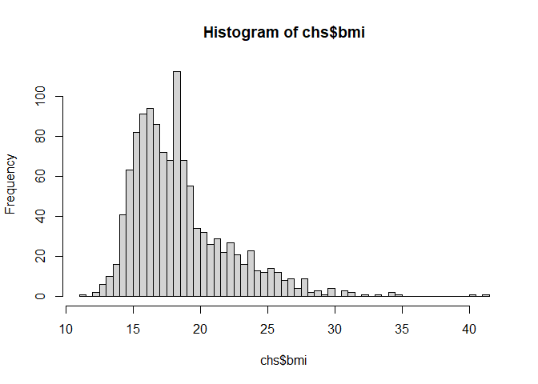<!-- -->

``` r
hist(chs$fev, breaks = 50)
```

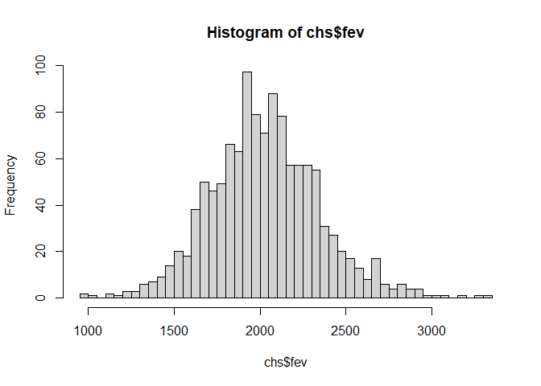<!-- -->

A quick visualization of all of the sites in the study:

``` r
leaflet(chs_regional) %>%
  addProviderTiles('OpenStreetMap') %>%
  addCircles(lat=~lat, lng=~lon, opacity=1, fillOpacity=1, radius=100)
```

<div id="htmlwidget-33e0d7aa52e4e0f3ca1e" style="width:672px;height:480px;" class="leaflet html-widget"></div>
<script type="application/json" data-for="htmlwidget-33e0d7aa52e4e0f3ca1e">{"x":{"options":{"crs":{"crsClass":"L.CRS.EPSG3857","code":null,"proj4def":null,"projectedBounds":null,"options":{}}},"calls":[{"method":"addProviderTiles","args":["OpenStreetMap",null,null,{"errorTileUrl":"","noWrap":false,"detectRetina":false}]},{"method":"addCircles","args":[[32.8350521,33.6680772,34.242901,34.6867846,34.6391501,33.7700504,33.9845417,33.9806005,34.1066756,35.4894169,34.9530337,34.09751],[-116.7664109,-117.3272615,-117.275233,-118.1541632,-120.4579409,-118.1937395,-117.5159449,-117.3754942,-117.8067257,-120.6707255,-120.4357191,-117.6483876],100,null,null,{"interactive":true,"className":"","stroke":true,"color":"#03F","weight":5,"opacity":1,"fill":true,"fillColor":"#03F","fillOpacity":1},null,null,null,{"interactive":false,"permanent":false,"direction":"auto","opacity":1,"offset":[0,0],"textsize":"10px","textOnly":false,"className":"","sticky":true},null,null]}],"limits":{"lat":[32.8350521,35.4894169],"lng":[-120.6707255,-116.7664109]}},"evals":[],"jsHooks":[]}</script>

### These three questions will be considered with the following visualizations:

What is the association between BMI and FEV?

What is the association between smoke and gas exposure and FEV?

What is the association between PM2.5 exposure and FEV?

``` r
chs <- chs %>%
  mutate(has_asthma = as.character(active_asthma))
```

# Visualization

### 1. Facet plot showing scatterplots with regression lines of BMI and FEV by “townname”

``` r
ggplot(chs, aes(x=bmi, y=fev)) +
  geom_point(aes(color = has_asthma)) +
  geom_smooth()+
  facet_wrap(~townname) +
  theme(legend.title = element_text(size = 10),
        legend.text = element_text(size = 7)) + 
  labs(title = 'BMI vs FEV in different towns')
```

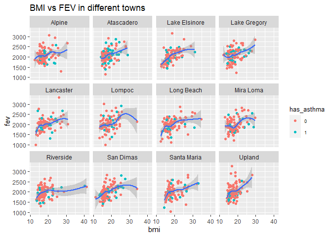<!-- -->

This plot does not suggest any immediately obvious conclusions. As
previously observed, FEV increases with BMI. No one town seems to be
much different than any other.

### 2. Stacked histogram of FEV by BMI category and FEV by smoke/gas exposure.

``` r
ggplot(chs, aes(fev, fill=obesity_level)) +
  geom_histogram(binwidth = 50)+ 
  labs(title = 'FEV by BMI category') +
  scale_fill_brewer(palette = "Spectral")
```

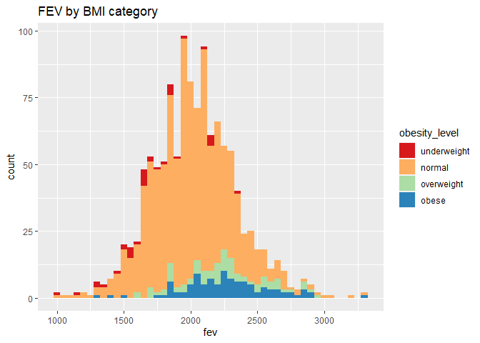<!-- -->

This plot does a good job of displaying the proportions between each
obesity level: by far the most prevalent group is “normal.” As seen
before, obesity is correlated with higher FEV.

``` r
ggplot(chs, aes(fev, fill=smoke_gas_exposure)) +
  geom_histogram(binwidth = 50) + 
  labs(title = 'FEV by Smoke & Gas Exposure') +
  scale_fill_brewer(palette = "Pastel2")
```

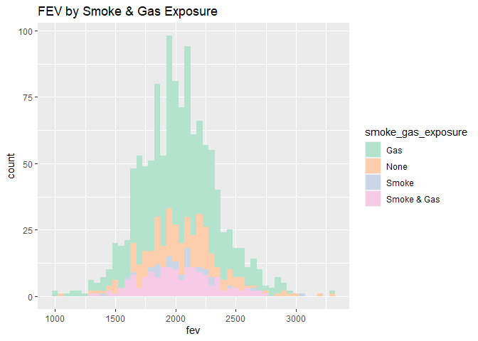<!-- -->

This chart provides information about the relative proportions of each
category in this group, but does not suggest much different in their
mean FEV values.

### 3. Barchart of BMI by smoke/gas exposure.

``` r
ggplot(chs, aes(fill = smoke_gas_exposure, x = obesity_level)) +
  geom_bar() + 
  labs(title = 'BMI by smoke & gas exposure')
```

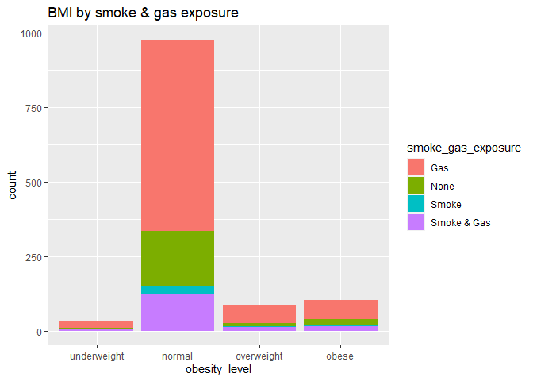<!-- -->

Because the above graph is hard to read due to the large difference in
scale between different obesity levels, it is helpful to normalize each
category, and compare by relative percentage:

``` r
ggplot(chs, aes(fill = smoke_gas_exposure, x = obesity_level)) +
  geom_bar(position = "fill") + 
  labs(title = 'BMI by smoke & gas exposure, normalized')
```

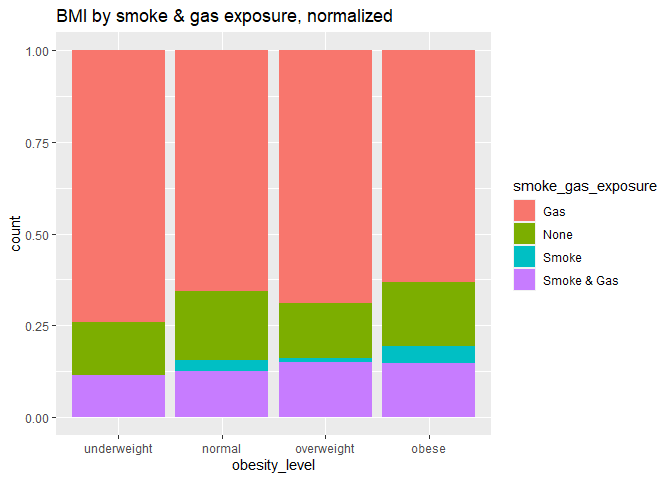<!-- -->

One conclusion that can be made from the above visualization is that as
obesity levels increase, there is a higher prevalence of smoke + smoke &
gas. This doesn’t say anything about asthma, but perhaps suggests
something about obesity and households with smokers.

### 4. Statistical summary graphs of FEV by BMI and FEV by smoke/gas exposure category.

``` r
gfev <- ggplot(chs, aes(y = fev))

gfev + 
  geom_point(aes(x = bmi, color = has_asthma)) + 
  geom_smooth(aes(x = bmi)) + 
  labs(title = 'Scatterplot of FEV by BMI') 
```

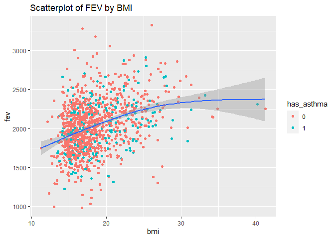<!-- -->

This scatter plot indicates a positive correlation between BMI and FEV.
There isn’t any clear distinction between the asthmatic and
non-asthmatic groups.

``` r
gfev + 
  geom_boxplot(aes(x = obesity_level)) + 
  labs(title = 'Boxplots of FEV by BMI')
```

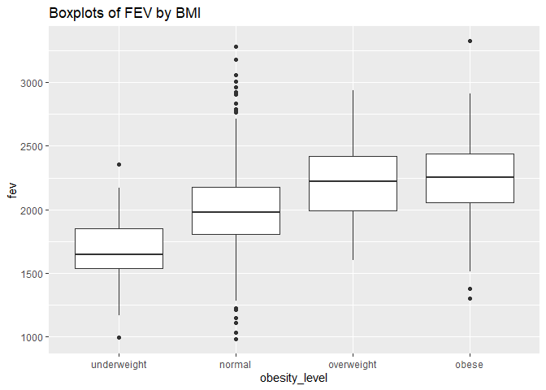<!-- -->

``` r
gfev + 
  geom_boxplot(aes(x = obesity_level, color = has_asthma)) + 
  labs(title = 'Boxplots of FEV by BMI, considering asthma') 
```

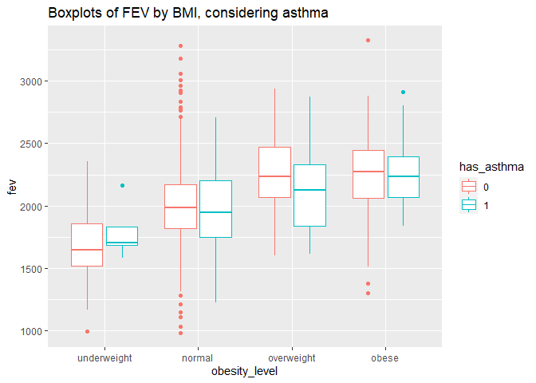<!-- -->

These box plots show a considerable increase in FEV as obesity level
increases. The second plot shows that within an obesity level,
asthmatics usually have a lower FEV.

``` r
gfev + 
  geom_point(aes(x = bmi, color = smoke_gas_exposure)) + 
  geom_smooth(aes(x = bmi)) + 
  labs(title = 'Scatterplot of FEV by BMI, considering smoke & gas exposure')
```

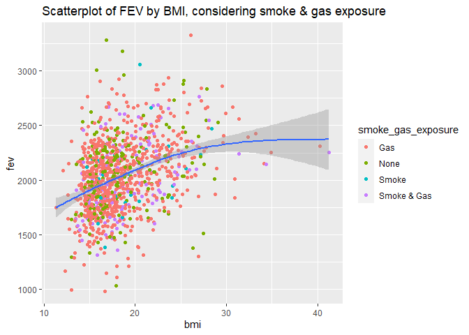<!-- -->

``` r
gfev + 
  geom_boxplot(aes(x = smoke_gas_exposure)) + 
  labs(title = 'Boxplots of FEV by smoke & gas exposure')
```

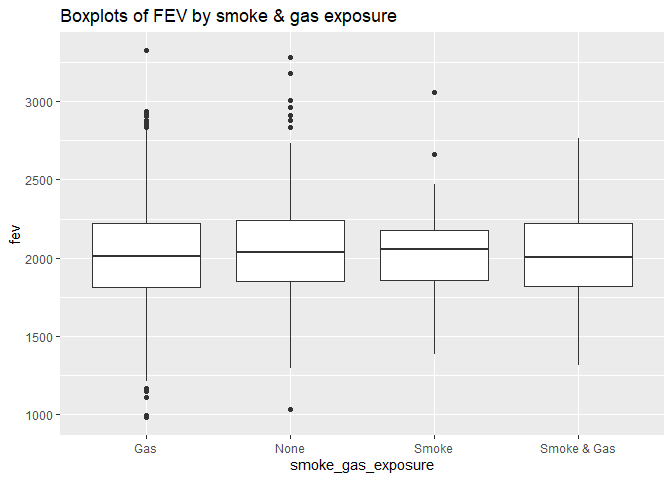<!-- -->

``` r
gfev + 
  geom_boxplot(aes(x = smoke_gas_exposure, color = has_asthma)) + 
  labs(title = 'Boxplots of FEV by smoke & gas exposure, considering asthma')
```

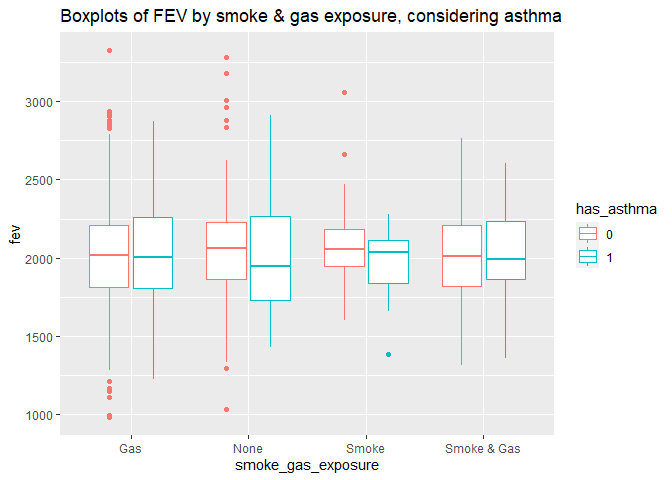<!-- -->

The scatter plot is not very illuminating. The box plots indicate a
slightly lower median FEV for those exposed to just gas or both smoke
and gas. Surprisingly, there isn’t a noticeably lower FEV for those
exposed to only smoke. The second box plot indicates that within each
smoke & gas category, there is usually a lower FEV for asthmatics than
for non-asthmatics.

### 5. A leaflet map showing the concentrations of PM2.5 mass in each of the CHS communities.

``` r
pal <- colorNumeric(palette = "plasma", domain = chs$pm25_mass)

leaflet(chs_regional) %>%
  addProviderTiles('OpenStreetMap') %>%
  addCircles(lat=~lat, lng=~lon, opacity=1, fillOpacity=1, radius=100, color = ~pal(pm25_mass)) %>%
  addLegend("bottomright", pal = pal, values = ~pm25_mass, title = "PM 2.5", opacity = 1)
```

<div id="htmlwidget-7c8d5db1e39fc97116ac" style="width:672px;height:480px;" class="leaflet html-widget"></div>
<script type="application/json" data-for="htmlwidget-7c8d5db1e39fc97116ac">{"x":{"options":{"crs":{"crsClass":"L.CRS.EPSG3857","code":null,"proj4def":null,"projectedBounds":null,"options":{}}},"calls":[{"method":"addProviderTiles","args":["OpenStreetMap",null,null,{"errorTileUrl":"","noWrap":false,"detectRetina":false}]},{"method":"addCircles","args":[[32.8350521,33.6680772,34.242901,34.6867846,34.6391501,33.7700504,33.9845417,33.9806005,34.1066756,35.4894169,34.9530337,34.09751],[-116.7664109,-117.3272615,-117.275233,-118.1541632,-120.4579409,-118.1937395,-117.5159449,-117.3754942,-117.8067257,-120.6707255,-120.4357191,-117.6483876],100,null,null,{"interactive":true,"className":"","stroke":true,"color":["#4903A0","#8405A7","#350498","#44039E","#0D0887","#D6556D","#F0F921","#EF7E50","#E26660","#310597","#2C0594","#F07F4F"],"weight":5,"opacity":1,"fill":true,"fillColor":["#4903A0","#8405A7","#350498","#44039E","#0D0887","#D6556D","#F0F921","#EF7E50","#E26660","#310597","#2C0594","#F07F4F"],"fillOpacity":1},null,null,null,{"interactive":false,"permanent":false,"direction":"auto","opacity":1,"offset":[0,0],"textsize":"10px","textOnly":false,"className":"","sticky":true},null,null]},{"method":"addLegend","args":[{"colors":["#0D0887 , #5E01A6 16.826322365681%, #AA2395 37.6509787588505%, #DE5F65 58.47563515202%, #FCA338 79.3002915451895%, #F0F921 "],"labels":["10","15","20","25"],"na_color":null,"na_label":"NA","opacity":1,"position":"bottomright","type":"numeric","title":"PM 2.5","extra":{"p_1":0.16826322365681,"p_n":0.793002915451895},"layerId":null,"className":"info legend","group":null}]}],"limits":{"lat":[32.8350521,35.4894169],"lng":[-120.6707255,-116.7664109]}},"evals":[],"jsHooks":[]}</script>

It is not surprising to see that the area around Los Angeles has higher
PM 2.5 values than those sites further from the city.

### 6. A visualization to examine whether PM2.5 mass is associated with FEV.

``` r
gfev + 
  geom_smooth(aes(x = pm25_mass)) + 
  labs(title = 'FEV vs PM 2.5 mass')
```

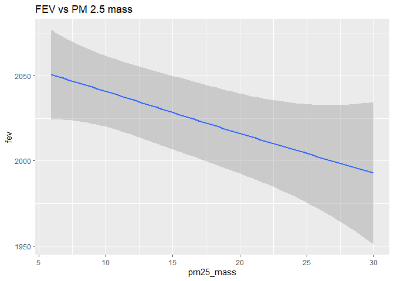<!-- -->

``` r
gfev + 
  geom_smooth(aes(x = pm25_mass, color = has_asthma)) + 
  labs(title = 'FEV vs PM 2.5 mass, considering asthma')
```

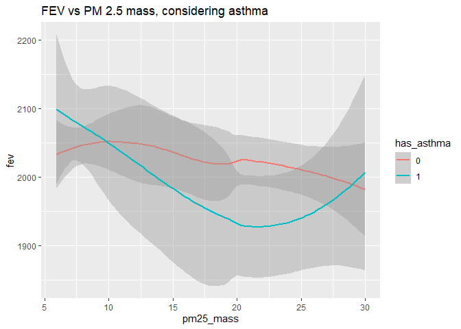<!-- -->

The simple regression plot of FEV vs PM 2.5 mass shows that there is a
negative correlation - where there are more particles in the air, FEV
drops (as expected).

The second plot shows this comparison for asthmatics and non-asthmatics.
Asthmatics appear to be more negatively affected by PM 2.5 - except for
an unusual upward blip at the higher end of PM 2.5.

``` r
gfev + 
  geom_boxplot(aes(x = pm25_mass, group = cut_width(pm25_mass, 8)), width = 5)+ 
  labs(title = 'Boxplots of FEV vs (grouped) PM 2.5 mass')
```

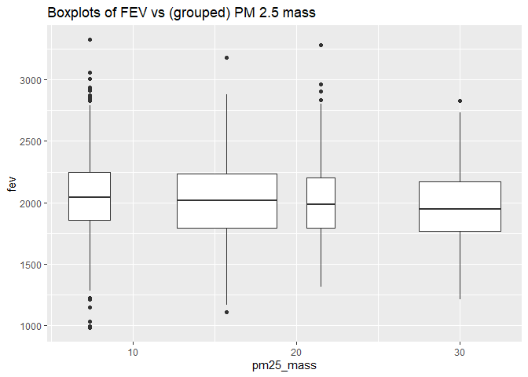<!-- -->

``` r
ggplot(chs, aes(x = fev)) + 
  geom_boxplot(aes(y = reorder(townname, -fev, FUN = median), color = pm25_mass)) + 
  labs(title = 'Boxplots of FEV per town, with color denoting PM2.5')
```

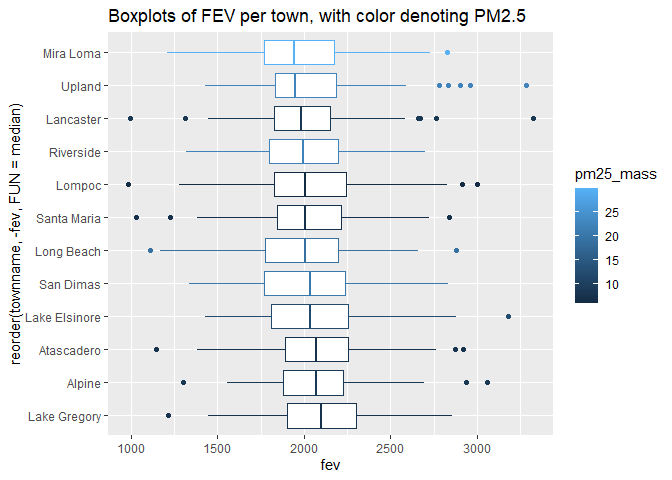<!-- -->

This first box plot is not very elegant (what PM 2.5 values exactly are
included in each box?), but it generally suggests that as PM 2.5
increases, median FEV decreases.

The second plot tells the same story: as we observe the towns ranked by
increasing FEV and apply a color gradient based on their PM 2.5 value,
we can observe the trend that PM 2.5 increases as FEV decreases.
