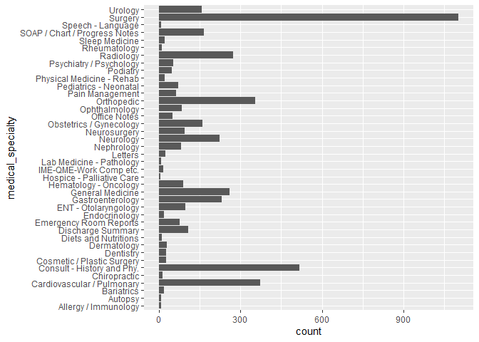
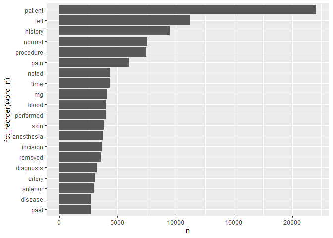
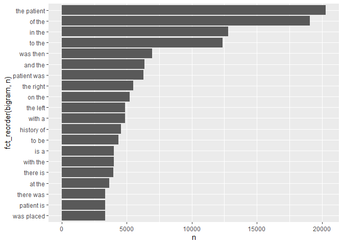

PM 566 Week 6 Lab
================
Chris Hanson
10/1/2021

``` r
library(tidyverse)
library(tidytext)
library(ggplot2)
```

### Data set description: Medical appointments, the associated medical specialty, a “transcription” of the outcome, and keywords.

``` r
fn  <- "mtsamples.csv"

if (!file.exists(fn))
  download.file("https://raw.githubusercontent.com/USCbiostats/data-science-data/master/00_mtsamples/mtsamples.csv", destfile = fn)

mtsamples <-  read.csv(fn)
mtsamples <- as_tibble(mtsamples)
```

## Question 1. How are specialties distributed?

``` r
specialties <- mtsamples %>%
  count(medical_specialty)

specialties %>%
  arrange(desc(n)) %>%
  top_n(n, 15) %>%
  knitr::kable()
```

| medical\_specialty            |    n |
|:------------------------------|-----:|
| Surgery                       | 1103 |
| Consult - History and Phy.    |  516 |
| Cardiovascular / Pulmonary    |  372 |
| Orthopedic                    |  355 |
| Radiology                     |  273 |
| General Medicine              |  259 |
| Gastroenterology              |  230 |
| Neurology                     |  223 |
| SOAP / Chart / Progress Notes |  166 |
| Obstetrics / Gynecology       |  160 |
| Urology                       |  158 |
| Discharge Summary             |  108 |
| ENT - Otolaryngology          |   98 |
| Neurosurgery                  |   94 |
| Hematology - Oncology         |   90 |
| Ophthalmology                 |   83 |
| Nephrology                    |   81 |
| Emergency Room Reports        |   75 |
| Pediatrics - Neonatal         |   70 |
| Pain Management               |   62 |
| Psychiatry / Psychology       |   53 |
| Office Notes                  |   51 |
| Podiatry                      |   47 |
| Dermatology                   |   29 |
| Cosmetic / Plastic Surgery    |   27 |
| Dentistry                     |   27 |
| Letters                       |   23 |
| Physical Medicine - Rehab     |   21 |
| Sleep Medicine                |   20 |
| Endocrinology                 |   19 |
| Bariatrics                    |   18 |
| IME-QME-Work Comp etc.        |   16 |
| Chiropractic                  |   14 |
| Diets and Nutritions          |   10 |
| Rheumatology                  |   10 |
| Speech - Language             |    9 |
| Autopsy                       |    8 |
| Lab Medicine - Pathology      |    8 |
| Allergy / Immunology          |    7 |
| Hospice - Palliative Care     |    6 |

There are 40 specialties. Let’s take a look at the distribution:

``` r
#
#Here we plot straight from the original data frame, flipping it to make the axis look nicer.
ggplot(mtsamples, aes(x = medical_specialty)) +
  geom_histogram(stat = "count") +
  coord_flip()
```

<!-- -->

``` r
#Here we plot from the limited data frame, reordering the specialty list based on the n value.
ggplot(specialties, aes(x = n, y = fct_reorder(medical_specialty, n))) +
  geom_col()
```

<!-- -->

These are not overlapping, nor are they evenly distributed.

## Question 2: Tokenizing words and counting them.

``` r
#Here we use the tidytext tool unnest_tokens to split the column "transcription" into individual words, labeling them "word". We then count each word and sort them. We then find the top 20 words. We then plot a bar chart of these 20 words, ordering the words based on the "n" assigned by the "count" function.
mtsamples %>%
  unnest_tokens(output = word, input = transcription) %>%
  count(word, sort = TRUE) %>%
  top_n(20) %>%
  ggplot(aes(x = n, y = fct_reorder(word, n))) +
    geom_col()
```

    ## Selecting by n

<!-- -->

This makes sense but is not illuminating. These are boring words that
everybody uses.

## Question 3: Remove the stop words and numbers.

``` r
#We use the tidytext tool "unnest_tokens" to split the column "transcription" into individual words, labeling them "word". We then count the words, and sort them. We then use the dplyr tool "anti_join" which returns all rows that aren't in the given data frame. We then use regex to remove numbers (grepl returns TRUE when a pattern is found, the pattern is any number). We then plot the top 20.

mtsamples %>%
  unnest_tokens(output = word, input = transcription) %>%
  count(word, sort = TRUE) %>%
  anti_join(stop_words, by = "word") %>%
  filter(!grepl(pattern = "^[0-9]+$", x = word)) %>%
  top_n(20) %>%
  ggplot(aes(x = n, y = fct_reorder(word, n))) +
    geom_col()
```

    ## Selecting by n

<!-- -->

This is far more interesting. Clearly this is a medical text.

## Question 4. Tokenize into bi-grams and tri-grams.

``` r
# Instead of unnest_tokens, we now use unnest_ngrams on the "transcription" column. We assign it to 2 word combinations, and call them "bigrams". We count these bigrams, sort them, find the top 20, and plot them. We do not remove stop words.
mtsamples %>%
  unnest_ngrams(output = bigram, input = transcription, n = 2) %>%
  count(bigram, sort = TRUE) %>%
  top_n(20) %>%
  ggplot(aes(x = n, y = fct_reorder(bigram, n))) +
    geom_col()
```

    ## Selecting by n

<!-- -->

Tri-grams:

``` r
#The same as above, but with 3 words in a row.
mtsamples %>%
  unnest_ngrams(output = trigram, input = transcription, n = 3) %>%
  count(trigram, sort = TRUE) %>%
  top_n(20) %>%
  ggplot(aes(x = n, y = fct_reorder(trigram, n))) +
    geom_col()
```

    ## Selecting by n

<!-- -->

Some fun phrases have appeared.

## Question 5: Find words before and after a keyword.

``` r
# We create a data frame called bigrams by calculating bigrams as we did before. We then use the tidyr function "separate" which breaks up our bigram based on spaces. We name the new variables "w1" and "w2". We then use the dyplr function "filter" to choose only the rows that either have "operation" assigned to w1 or w2.
bigrams <- mtsamples %>%
  unnest_ngrams(output = bigram, input = transcription, n = 2) %>%
  separate(bigram, into = c("w1", "w2"), sep = " ") %>%
  filter((w1 == "operation") | (w2 == "operation"))

# We take this data frame, which has w1 and w2 columns (one of which contains the word operation), and filter again for when w1 is "operation". We then use the dplyr function "select" to create a tibble of just w1 and w2. We then (dplyr) count the words in w2 and sort them on frequency. This finds all words that come after "operation".
bigrams %>%  
  filter(w1 == "operation") %>%
  select(w1, w2) %>%
  count(w2, sort = TRUE)
```

    ## # A tibble: 94 x 2
    ##    w2            n
    ##    <chr>     <int>
    ##  1 the         174
    ##  2 performed   159
    ##  3 1            46
    ##  4 in           25
    ##  5 right        22
    ##  6 was          22
    ##  7 after        20
    ##  8 bilateral    18
    ##  9 this         18
    ## 10 and          16
    ## # ... with 84 more rows

``` r
#The same as above, except now we find words before "operation". 
bigrams %>%  
  filter(w2 == "operation") %>%
  select(w1, w2) %>%
  count(w1, sort = TRUE)
```

    ## # A tibble: 129 x 2
    ##    w1           n
    ##    <chr>    <int>
    ##  1 of         226
    ##  2 the        129
    ##  3 for         73
    ##  4 this        13
    ##  5 re          12
    ##  6 norwood      9
    ##  7 same         9
    ##  8 cancer       7
    ##  9 mass         7
    ## 10 aneurysm     6
    ## # ... with 119 more rows

Let’s filter out stop words and numbers.

``` r
# Same as above, except after we filter for w1 = "operation", we filter out any rows in which w2 either belongs to the list of stop words or is a number. We then count, sort, and display it.
bigrams %>%
  filter(w1 == "operation") %>%
  filter(!(w2 %in% stop_words$word) & !grepl("^[0-9]+$", w2)) %>%
  count(w2, sort = TRUE) %>%
  top_n(10) %>%
  knitr::kable(caption = "Words before 'operation'")
```

    ## Selecting by n

| w2                  |   n |
|:--------------------|----:|
| performed           | 159 |
| bilateral           |  18 |
| left                |  15 |
| excision            |  13 |
| procedure           |   9 |
| cystoscopy          |   8 |
| expected            |   8 |
| loss                |   8 |
| phacoemulsification |   8 |
| endoscopic          |   6 |
| headaches           |   6 |

Words before ‘operation’

``` r
# Same as above, except for words coming before "operation". 
bigrams %>%
  filter(w2 == "operation") %>%
  filter(!(w1 %in% stop_words$word) & !grepl("^[0-9]+$", w2)) %>%
  count(w1, sort = TRUE) %>%
  top_n(10) %>%
  knitr::kable(caption = "Words after 'operation'")
```

    ## Selecting by n

| w1           |   n |
|:-------------|----:|
| norwood      |   9 |
| cancer       |   7 |
| mass         |   7 |
| aneurysm     |   6 |
| compression  |   6 |
| entrapment   |   6 |
| neurosurgery |   6 |
| disease      |   5 |
| rupture      |   5 |
| stenosis     |   5 |

Words after ‘operation’

## Question 6: Top words per specialty.

``` r
#Here we unnest the "transcription" column into words and use (dplyr) group_by to reorder our list grouped by the medical_specialty column. We count the words and sort them, filter out stop words and numbers (143,000 values), find the top 5 (210 values, this must find the top 5 based on medical_specialty?), arrange them alphabetically, and display.
wps <- mtsamples %>%
  unnest_tokens(word, input = transcription) %>%
  group_by(medical_specialty) %>%
  count(word, sort = TRUE) %>%
  filter(!(word %in% stop_words$word) & !grepl("^[0-9]+$", word)) %>%
  top_n(5) %>%
  arrange(medical_specialty, n)
```

    ## Selecting by n

``` r
knitr::kable(wps)
```

| medical\_specialty            | word         |    n |
|:------------------------------|:-------------|-----:|
| Allergy / Immunology          | nasal        |   13 |
| Allergy / Immunology          | past         |   13 |
| Allergy / Immunology          | allergies    |   21 |
| Allergy / Immunology          | patient      |   22 |
| Allergy / Immunology          | noted        |   23 |
| Allergy / Immunology          | history      |   38 |
| Autopsy                       | body         |   40 |
| Autopsy                       | anterior     |   47 |
| Autopsy                       | neck         |   55 |
| Autopsy                       | inch         |   59 |
| Autopsy                       | left         |   83 |
| Bariatrics                    | gastric      |   30 |
| Bariatrics                    | surgery      |   34 |
| Bariatrics                    | weight       |   36 |
| Bariatrics                    | history      |   50 |
| Bariatrics                    | patient      |   62 |
| Cardiovascular / Pulmonary    | history      |  654 |
| Cardiovascular / Pulmonary    | coronary     |  681 |
| Cardiovascular / Pulmonary    | artery       | 1085 |
| Cardiovascular / Pulmonary    | patient      | 1516 |
| Cardiovascular / Pulmonary    | left         | 1550 |
| Chiropractic                  | left         |   54 |
| Chiropractic                  | history      |   56 |
| Chiropractic                  | dr           |   66 |
| Chiropractic                  | patient      |   85 |
| Chiropractic                  | pain         |  187 |
| Consult - History and Phy.    | mg           |  908 |
| Consult - History and Phy.    | pain         | 1153 |
| Consult - History and Phy.    | normal       | 1368 |
| Consult - History and Phy.    | history      | 2820 |
| Consult - History and Phy.    | patient      | 3046 |
| Cosmetic / Plastic Surgery    | incision     |   67 |
| Cosmetic / Plastic Surgery    | skin         |   88 |
| Cosmetic / Plastic Surgery    | breast       |   95 |
| Cosmetic / Plastic Surgery    | procedure    |   98 |
| Cosmetic / Plastic Surgery    | patient      |  116 |
| Dentistry                     | procedure    |   82 |
| Dentistry                     | left         |   94 |
| Dentistry                     | teeth        |  104 |
| Dentistry                     | tooth        |  108 |
| Dentistry                     | patient      |  195 |
| Dermatology                   | procedure    |   44 |
| Dermatology                   | left         |   58 |
| Dermatology                   | cm           |   77 |
| Dermatology                   | patient      |  101 |
| Dermatology                   | skin         |  101 |
| Diets and Nutritions          | food         |   27 |
| Diets and Nutritions          | plan         |   27 |
| Diets and Nutritions          | day          |   28 |
| Diets and Nutritions          | carbohydrate |   37 |
| Diets and Nutritions          | weight       |   40 |
| Diets and Nutritions          | patient      |   43 |
| Discharge Summary             | hospital     |  183 |
| Discharge Summary             | history      |  208 |
| Discharge Summary             | mg           |  301 |
| Discharge Summary             | discharge    |  358 |
| Discharge Summary             | patient      |  672 |
| Emergency Room Reports        | denies       |  149 |
| Emergency Room Reports        | normal       |  255 |
| Emergency Room Reports        | pain         |  273 |
| Emergency Room Reports        | history      |  356 |
| Emergency Room Reports        | patient      |  685 |
| Endocrinology                 | dissection   |   45 |
| Endocrinology                 | gland        |   45 |
| Endocrinology                 | nerve        |   45 |
| Endocrinology                 | history      |   57 |
| Endocrinology                 | left         |   63 |
| Endocrinology                 | patient      |  121 |
| Endocrinology                 | thyroid      |  129 |
| ENT - Otolaryngology          | procedure    |  181 |
| ENT - Otolaryngology          | ear          |  182 |
| ENT - Otolaryngology          | left         |  219 |
| ENT - Otolaryngology          | nasal        |  281 |
| ENT - Otolaryngology          | patient      |  415 |
| Gastroenterology              | colon        |  240 |
| Gastroenterology              | normal       |  328 |
| Gastroenterology              | history      |  341 |
| Gastroenterology              | procedure    |  470 |
| Gastroenterology              | patient      |  872 |
| General Medicine              | mg           |  503 |
| General Medicine              | pain         |  567 |
| General Medicine              | normal       |  717 |
| General Medicine              | history      | 1027 |
| General Medicine              | patient      | 1356 |
| Hematology - Oncology         | mass         |   97 |
| Hematology - Oncology         | mg           |  107 |
| Hematology - Oncology         | left         |  187 |
| Hematology - Oncology         | history      |  290 |
| Hematology - Oncology         | patient      |  316 |
| Hospice - Palliative Care     | family       |   19 |
| Hospice - Palliative Care     | pain         |   19 |
| Hospice - Palliative Care     | daughter     |   22 |
| Hospice - Palliative Care     | history      |   27 |
| Hospice - Palliative Care     | mg           |   28 |
| Hospice - Palliative Care     | patient      |   43 |
| IME-QME-Work Comp etc.        | left         |   70 |
| IME-QME-Work Comp etc.        | injury       |   81 |
| IME-QME-Work Comp etc.        | dr           |   82 |
| IME-QME-Work Comp etc.        | patient      |  106 |
| IME-QME-Work Comp etc.        | pain         |  152 |
| Lab Medicine - Pathology      | upper        |   20 |
| Lab Medicine - Pathology      | lobe         |   29 |
| Lab Medicine - Pathology      | lymph        |   30 |
| Lab Medicine - Pathology      | cm           |   35 |
| Lab Medicine - Pathology      | tumor        |   35 |
| Letters                       | dr           |   46 |
| Letters                       | normal       |   53 |
| Letters                       | patient      |   65 |
| Letters                       | abc          |   71 |
| Letters                       | pain         |   80 |
| Nephrology                    | left         |  132 |
| Nephrology                    | kidney       |  144 |
| Nephrology                    | history      |  160 |
| Nephrology                    | renal        |  257 |
| Nephrology                    | patient      |  348 |
| Neurology                     | time         |  278 |
| Neurology                     | history      |  429 |
| Neurology                     | normal       |  485 |
| Neurology                     | patient      |  648 |
| Neurology                     | left         |  672 |
| Neurosurgery                  | left         |  222 |
| Neurosurgery                  | procedure    |  247 |
| Neurosurgery                  | c6           |  266 |
| Neurosurgery                  | c5           |  289 |
| Neurosurgery                  | patient      |  374 |
| Obstetrics / Gynecology       | normal       |  276 |
| Obstetrics / Gynecology       | incision     |  293 |
| Obstetrics / Gynecology       | procedure    |  301 |
| Obstetrics / Gynecology       | uterus       |  317 |
| Obstetrics / Gynecology       | patient      |  628 |
| Office Notes                  | noted        |   60 |
| Office Notes                  | history      |   76 |
| Office Notes                  | patient      |   94 |
| Office Notes                  | negative     |  193 |
| Office Notes                  | normal       |  230 |
| Ophthalmology                 | chamber      |  149 |
| Ophthalmology                 | anterior     |  150 |
| Ophthalmology                 | procedure    |  176 |
| Ophthalmology                 | patient      |  258 |
| Ophthalmology                 | eye          |  456 |
| Orthopedic                    | lateral      |  472 |
| Orthopedic                    | procedure    |  669 |
| Orthopedic                    | pain         |  763 |
| Orthopedic                    | left         |  998 |
| Orthopedic                    | patient      | 1711 |
| Pain Management               | injected     |   76 |
| Pain Management               | pain         |   76 |
| Pain Management               | needle       |  156 |
| Pain Management               | procedure    |  197 |
| Pain Management               | patient      |  236 |
| Pediatrics - Neonatal         | child        |   82 |
| Pediatrics - Neonatal         | mom          |   82 |
| Pediatrics - Neonatal         | normal       |  155 |
| Pediatrics - Neonatal         | history      |  235 |
| Pediatrics - Neonatal         | patient      |  247 |
| Physical Medicine - Rehab     | history      |   54 |
| Physical Medicine - Rehab     | motor        |   62 |
| Physical Medicine - Rehab     | pain         |   95 |
| Physical Medicine - Rehab     | left         |  104 |
| Physical Medicine - Rehab     | patient      |  220 |
| Podiatry                      | incision     |   96 |
| Podiatry                      | tendon       |   98 |
| Podiatry                      | left         |  137 |
| Podiatry                      | patient      |  231 |
| Podiatry                      | foot         |  232 |
| Psychiatry / Psychology       | reported     |  141 |
| Psychiatry / Psychology       | mother       |  164 |
| Psychiatry / Psychology       | mg           |  183 |
| Psychiatry / Psychology       | history      |  344 |
| Psychiatry / Psychology       | patient      |  532 |
| Radiology                     | mild         |  242 |
| Radiology                     | exam         |  302 |
| Radiology                     | patient      |  304 |
| Radiology                     | normal       |  644 |
| Radiology                     | left         |  701 |
| Rheumatology                  | day          |   22 |
| Rheumatology                  | examination  |   22 |
| Rheumatology                  | joints       |   22 |
| Rheumatology                  | pain         |   23 |
| Rheumatology                  | mg           |   26 |
| Rheumatology                  | patient      |   34 |
| Rheumatology                  | history      |   50 |
| Sleep Medicine                | stage        |   29 |
| Sleep Medicine                | activity     |   31 |
| Sleep Medicine                | apnea        |   35 |
| Sleep Medicine                | patient      |   69 |
| Sleep Medicine                | sleep        |  143 |
| SOAP / Chart / Progress Notes | blood        |  194 |
| SOAP / Chart / Progress Notes | pain         |  239 |
| SOAP / Chart / Progress Notes | history      |  254 |
| SOAP / Chart / Progress Notes | mg           |  302 |
| SOAP / Chart / Progress Notes | patient      |  537 |
| Speech - Language             | evaluation   |   17 |
| Speech - Language             | goals        |   17 |
| Speech - Language             | term         |   17 |
| Speech - Language             | time         |   17 |
| Speech - Language             | patient’s    |   28 |
| Speech - Language             | speech       |   35 |
| Speech - Language             | therapy      |   41 |
| Speech - Language             | patient      |  105 |
| Surgery                       | incision     | 1641 |
| Surgery                       | anesthesia   | 1687 |
| Surgery                       | procedure    | 3243 |
| Surgery                       | left         | 3263 |
| Surgery                       | patient      | 4855 |
| Urology                       | history      |  196 |
| Urology                       | left         |  288 |
| Urology                       | procedure    |  306 |
| Urology                       | bladder      |  357 |
| Urology                       | patient      |  776 |
